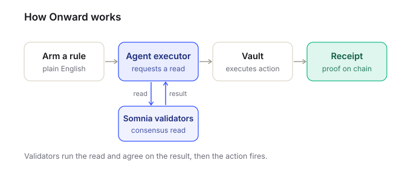
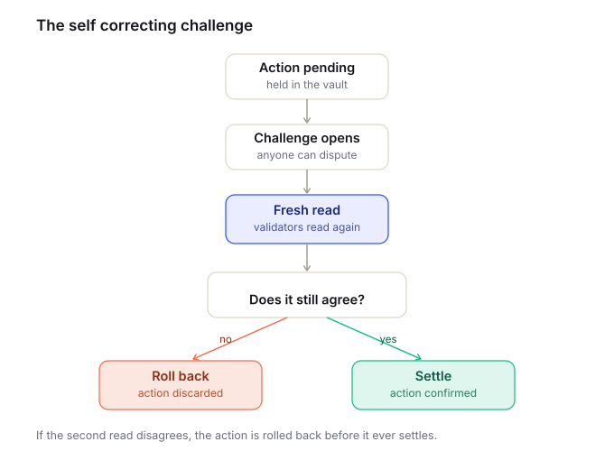
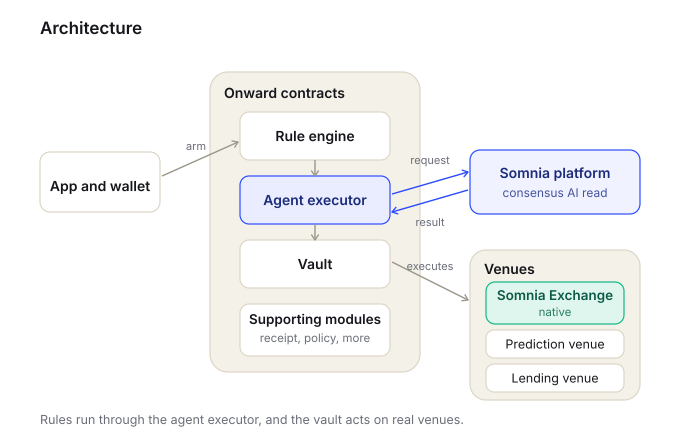

# Onward

**Your rules. Onward without you.**

[](https://shannon-explorer.somnia.network)
[](https://onwardsom.xyz/)
[](https://soliditylang.org)
[](https://react.dev)

[Live site](https://onwardsom.xyz/) &nbsp;·&nbsp; [Demo video](https://youtu.be/1PlTqYEXd_s) &nbsp;·&nbsp; [GitHub](https://github.com/Vinaystwt/onward)

---

## Table of contents

1. [Problem](#problem)
2. [Solution](#solution)
3. [Why we built this](#why-we-built-this)
4. [The self correcting challenge](#the-self-correcting-challenge)
5. [Why Somnia](#why-somnia)
6. [Architecture](#architecture)
7. [Features](#features)
8. [Connectors](#connectors)
9. [Deployed contracts](#deployed-contracts)
10. [Target users](#target-users)
11. [Roadmap](#roadmap)
12. [Run locally](#run-locally)

---

## Problem

Acting on real world events with on-chain money means being awake, connected, and fast. Autonomous
wallets solve the availability problem, but autonomous money is powerful and hard to trust: you need
to know the wallet acted on what actually happened, not on a stale or manipulated reading that no
one can audit after the fact.

---

## Solution

Onward is a self driving wallet where users set plain English rules. An on-chain agent reads a
source through Somnia consensus AI and executes within spend caps, writing an auditable receipt.
Onward does not verify ground truth. It guarantees that an action executes only against the
network's current consensus reading at settlement. If the reading changed between the original
evaluation and settlement, the vault rolls the action back automatically.



---

## Why we built this

Autonomous on-chain agents need a trust mechanism native to the chain, not bolted on through oracles
and keepers. Push oracles and off-chain bots can tell you what happened, but they cannot
re-adjudicate an action under the same quorum assumptions that produced the original decision.
Somnia makes that re-adjudication a first-class consensus operation, so the rollback guarantee is
enforced at the protocol level, not by a trusted operator.

---

## The self correcting challenge

When a rule fires, the vault reserves funds and opens a pending action. While the challenge window
is open any party can call `Challenge.challenge(actionId)`. The contract opens a fresh Somnia
consensus request against the same source URL. Two outcomes only: consensus agrees and the vault
settles; consensus disagrees and the vault rolls the action back and returns the reserved funds
before any money moves.

This is a native consensus operation the validators perform inside the protocol before settlement,
not a keeper re-querying an oracle.



### Live rollback proof

Live evaluations make a real consensus request to the Somnia agent platform and settle asynchronously. The receipts and rollback proof shown below are permanent on-chain records of completed runs.


*Receipt for action 2: source read value 1 (below threshold, decision: fire), source then updated to
3 via HTTP PUT, challenge reread returned 3 (above threshold), vault rolled back before settlement.*

**Rollback sequence (action 2)** — source value changed between first read and challenge:

| Step | Description | Transaction |
|------|-------------|-------------|
| First read | EvaluationCompleted, source value 1, decision fire | [0xab888985](https://shannon-explorer.somnia.network/tx/0xab888985cfe08f65559d355f133ca3f0d9a4f422c45ce6f909a4cb19f11f9534) |
| Challenge | Fresh read returned 3, disagreed, rolled back | [0x7c468d84](https://shannon-explorer.somnia.network/tx/0x7c468d841b18c82c12122049c386651faa8fd074b66bb1b30abcd97a482baa50) |

**Settle sequence (action 3)** — source value unchanged, challenge agreed and settled:

| Step | Description | Transaction |
|------|-------------|-------------|
| First read | EvaluationCompleted, source value 1, decision fire | [0x65ee62ea](https://shannon-explorer.somnia.network/tx/0x65ee62eaeb46b7bc61f139249b49c11770123bae2beb2754f46061a64cc2c8b4) |
| Challenge | Fresh read returned 1, agreed, settled | [0x8deeec89](https://shannon-explorer.somnia.network/tx/0x8deeec897a481e7d775d874c37beead002e29bb28524743521935855a4f9783a) |

---

## Why Somnia

With a conventional oracle the re-adjudication is just another off-chain request: you must trust a
keeper to trigger it and a network to honor the result under the same assumptions as the original
read. On Somnia the challenge is a consensus operation the validators perform inside the protocol.
The rollback is not promised by a contract owner. It is enforced by the same quorum that produced
the first decision, which means the guarantee is non-portable: it exists because Somnia's consensus
layer can run arbitrary reads as a first-class operation.

---

## Architecture



The system has nine contracts, each with one job. The RuleEngine stores user rules and starts
evaluation cycles. The AgentExecutor creates Somnia consensus requests and opens pending vault
actions. The Vault custodies STT, reserves funds, and settles or rolls back. The Challenge contract
runs independent re-reads and resolves pending actions. PolicyLimits enforces per-rule spend caps
and rate limits. ReceiptLog writes queryable audit receipts. TrackRecord accumulates accuracy
counters. AdapterRegistry routes action calls to venue adapters, with a native Algebra trading
adapter and two reference adapters for prediction and lending.

---

## Features

- **Plain English rules.** Users arm rules in natural language with a threshold, spend cap, and
  action domain. No code.
- **Autonomous execution.** An on-chain agent reads a source through Somnia consensus AI and
  executes within caps, writing an on-chain receipt.
- **Pre-settlement rollback.** Any party can challenge. The network performs a fresh consensus
  reading and rolls back the action if the result changed. Proven on testnet with linkable
  transactions.
- **Five-tier provenance receipts.** Every receipt field is tagged by origin: USER_DEFINED, SOURCE,
  AGENT_INFERRED, ON_CHAIN_ENFORCED, or CONSENSUS_VERIFIED.
- **Spend caps enforced at the contract level.** Each rule has a per-fire cap and a per-period limit
  stored in PolicyLimits. The vault enforces both before opening any action.
- **Pluggable adapter interface.** Any venue that implements IVenueAdapter can be registered and
  routed to from a rule.

---

## Connectors

| Venue | Type | Description |
|-------|------|-------------|
| Somnia Exchange | Native | Real Algebra exact-input swaps on the native Somnia DEX |
| MinimalPredictionMarket | Reference | Real YES and NO balances, real settle accounting |
| MiniLendingPool | Reference | Real supply and borrow accounting |

Trading is a live third-party venue integration. Prediction and lending are fully deployed reference
venues that make the end-to-end loop honest without requiring an upstream protocol.

---

## Deployed contracts

All contracts are deployed on Somnia testnet (chain id 50312).

| Contract | Role | Address |
|----------|------|---------|
| RuleEngine | Stores user rules and starts evaluation cycles | [0x9E5C97B8](https://shannon-explorer.somnia.network/address/0x9E5C97B83696eC46db29877428E1F2528984Ca80) |
| AgentExecutor | Creates consensus requests and opens pending vault actions | [0x734E260E](https://shannon-explorer.somnia.network/address/0x734E260E63d4a08a4F4b5F6177B938f6740A56d3) |
| Vault | Custodies STT, reserves pending actions, settles or rolls back | [0x26211197](https://shannon-explorer.somnia.network/address/0x26211197012061B75df41D44cf836aBBEB69b506) |
| Challenge | Runs independent re-reads and settles or rolls back pending actions | [0xFb74D0De](https://shannon-explorer.somnia.network/address/0xFb74D0De3AaC051c123E0561ab904977E1bf4305) |
| ReceiptLog | Queryable audit receipts for pending, settled, and rolled-back actions | [0x542F6548](https://shannon-explorer.somnia.network/address/0x542F6548D6D93416466dc4a62F8CE44FfF2997cd) |
| PolicyLimits | Per-rule spend caps, rate limits, and trust ceiling | [0xB58e41cf](https://shannon-explorer.somnia.network/address/0xB58e41cf6f2C1509786c56743171464a097BA8aE) |
| TrackRecord | Accuracy counters and rule leaderboard | [0x606AB70e](https://shannon-explorer.somnia.network/address/0x606AB70e0da747B07fB3411D2A1cf2647eAF5D7f) |
| AdapterRegistry | Domain-to-adapter routing registry | [0xc3AfbAAF](https://shannon-explorer.somnia.network/address/0xc3AfbAAFA8C1Bc769A83996A27626a60c5Bfad44) |
| Registry | Supported event and action type registry | [0x65f22f4c](https://shannon-explorer.somnia.network/address/0x65f22f4cAD6438c1Ac7B77406fA22cBA1CaF8c9a) |
| NativeAlgebraTradingAdapter | Encodes native Algebra exact-input swaps on Somnia Exchange | [0xE890c191](https://shannon-explorer.somnia.network/address/0xE890c191C416cAa6F0849A0AC073686F65c5D9CE) |
| PredictionMarketAdapter | Encodes prediction market buy-YES actions | [0xBf75a971](https://shannon-explorer.somnia.network/address/0xBf75a971eD7B99CcC552d4622bECE0dE17Db0C34) |
| LendingAdapter | Encodes lending supply actions | [0xf324473e](https://shannon-explorer.somnia.network/address/0xf324473e7e60de22593bF86725C08c4845783804) |
| MinimalPredictionMarket | Reference prediction venue with real YES/NO balances | [0x5092f135](https://shannon-explorer.somnia.network/address/0x5092f13565abE4b72C1Ef1a4Fad24A08Cc9C273b) |
| MiniLendingPool | Reference lending venue with real supply/borrow accounting | [0x0bB8ba57](https://shannon-explorer.somnia.network/address/0x0bB8ba5780F450163D2ccCe0ACbaEC9487A0C0eF) |

---

## Target users

**Retail.** Set a rule, fund the vault, walk away. The wallet acts on your conditions without you
being at the keyboard.

**DAOs and treasuries.** Codify recurring treasury actions as on-chain rules with spend caps and
challenge windows, so the community can audit every execution before it settles.

**On-chain funds.** Use the provenance receipt as an audit trail: every read, decision, and outcome
is tagged by origin and permanently recorded.

---

## Roadmap

### Shipped

- Plain English rules with spend caps enforced at the contract level
- Autonomous execution through Somnia consensus AI with on-chain receipts
- The self correcting challenge, proven on testnet with linkable transactions
- Five-tier provenance receipts: USER_DEFINED, SOURCE, AGENT_INFERRED, ON_CHAIN_ENFORCED, CONSENSUS_VERIFIED
- Native Somnia Exchange connector and two deployed reference venue adapters

### Q3 2026: Trust and incentives

- Challenge bonds and rewards: challengers post a bond, successful challenges earn a reward, failed challenges are slashed
- Multi source reads: rules can require several independent sources so no single source decides alone
- A second native venue integration on Somnia

### Q4 2026: Expressive rules

- Composable rule builder with multi-condition logic and multi-step actions
- Broader interpretive conditions as the on-chain model improves
- Open adapter interface with documentation for third-party venue builders

### Q1 2027: Open network and mainnet

- Public track record and reputation layer: rule types and agents accumulate verifiable on-chain history
- Mainnet readiness: third-party audits, monitoring, and enforced on-chain invariants
- Early partner integrations announced closer to mainnet

---

## Run locally

```bash
git clone https://github.com/Vinaystwt/onward.git
cd onward/frontend
npm install
npm run dev
```

The app runs at `http://localhost:5173`. Connect a browser wallet, switch to Somnia testnet
(chain id 50312, RPC `https://dream-rpc.somnia.network`), and fund the vault to arm your first rule.

Contracts and deployment scripts live at the repo root. The Foundry test suite is at `test/`.
